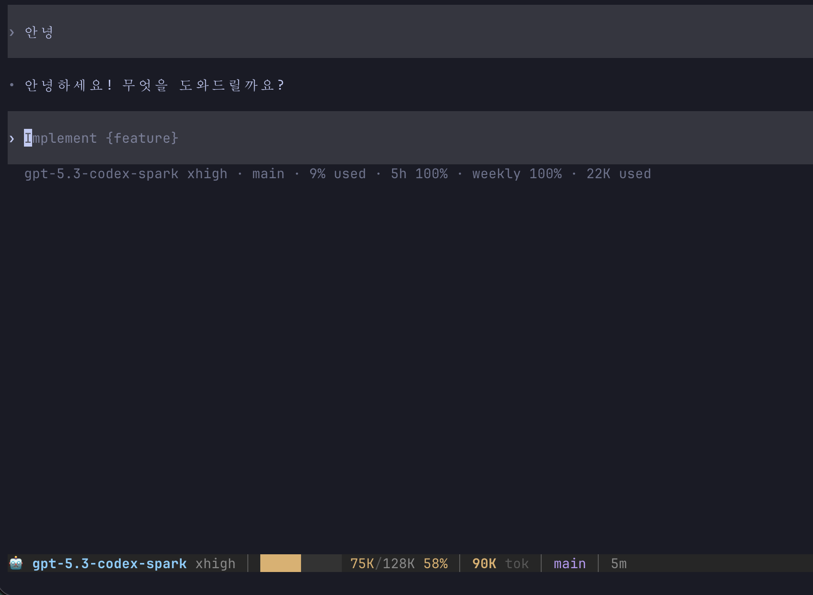

# codex-ultimate-hud

> Codex CLI 쓸 때 "지금 토큰 얼마나 쓴 거지...?" 하고 불안했던 적 있으시죠?
>
> 이제 하단 상태바에서 실시간으로 다 보입니다.

**OpenAI Codex CLI** 전용 실시간 HUD (Head-Up Display)

Claude Code에서 사용하던 [claude-ultimate-hud](https://github.com/anthropics/claude-code)의 감성을 Codex CLI로 가져왔습니다.

Made by **AI영끌맨** | https://www.threads.com/@ai_younggle_man

---

## 미리보기



```
🤖 gpt-5.3-codex-spark xhigh │ █████░░░░░ 75K/128K 58% │ 90K tok │ main │ 33m │ e21 p5 c3
```

### 각 구간이 뭘 의미하나요?

| 구간 | 설명 |
|------|------|
| `🤖 모델명 reasoning` | 현재 사용 중인 모델과 추론 강도 |
| `█████░░░░░ 75K/128K 58%` | 컨텍스트 윈도우 사용량 (게이지바 + 사용/전체 + 퍼센트) |
| `90K tok` | 이번 세션에서 소비한 총 토큰 |
| `main` | 현재 git 브랜치 |
| `33m` | 세션 경과 시간 |
| `e21 p5 c3` | 도구 호출 횟수: **e**xec, **p**atch, **s**hell, **m**cp, **c**ompact |

### 컨텍스트 바 색상 가이드

- **초록** (< 50%) — 여유 넉넉, 마음껏 쓰세요
- **노랑** (50~80%) — 슬슬 차오르는 중...
- **빨강** (> 80%) — 거의 꽉 참! 곧 자동 압축(compact) 됩니다

---

## 설치

### 한 줄 설치 (추천)

```bash
curl -fsSL https://raw.githubusercontent.com/hadamyeedady12-dev/codex-ultimate-hud/main/install.sh | bash
```

> 설치 시 SHA256 체크섬 검증이 자동으로 진행됩니다.

### 직접 설치

```bash
git clone https://github.com/hadamyeedady12-dev/codex-ultimate-hud.git
cd codex-ultimate-hud
mkdir -p ~/.codex/hud
cp status.sh tmux.conf launch.sh ~/.codex/hud/
chmod +x ~/.codex/hud/status.sh ~/.codex/hud/launch.sh
echo 'alias cxh="~/.codex/hud/launch.sh"' >> ~/.zshrc
source ~/.zshrc
```

---

## 사용법

```bash
cxh                        # Codex + HUD 실행
cxh -m gpt-5.3             # 모델 지정해서 실행
cxh -q "버그 고쳐줘"         # 프롬프트와 함께 시작
CXH_FULL_AUTO=1 cxh        # 풀오토 모드 (승인 없이 전부 자동 실행)
```

tmux 하단에 상태바가 나타나고, **5초마다 자동 갱신**됩니다.

> **참고**: 기본은 안전 모드입니다. `CXH_FULL_AUTO=1`을 붙이면 `--dangerously-bypass-approvals-and-sandbox`가 활성화됩니다. 말 그대로 "위험하게" 전부 자동 승인이니, 본인 책임 하에 사용하세요!

---

## 필요한 것들

| 항목 | 설치 방법 |
|------|-----------|
| **macOS** 또는 **Linux** | - |
| [OpenAI Codex CLI](https://github.com/openai/codex) | `npm install -g @openai/codex` |
| [tmux](https://github.com/tmux/tmux) | `brew install tmux` |
| bash 4+ | `brew install bash` (macOS 기본은 3.2라 업그레이드 필요!) |

---

## 어떻게 동작하나요?

```
┌─────────────────────────────────────────────┐
│                                             │
│          Codex TUI (전체 화면)                │
│                                             │
├─────────────────────────────────────────────┤
│ 🤖 model │ ████░░ 75K/128K │ 90K tok │ ... │  ← 여기가 HUD!
└─────────────────────────────────────────────┘
```

| 파일 | 역할 |
|------|------|
| `launch.sh` | Codex를 tmux 세션으로 감싸서 HUD와 함께 실행 |
| `status.sh` | `~/.codex/log/codex-tui.log`를 파싱해서 실시간 지표 생성 |
| `tmux.conf` | 상태바 색상과 레이아웃 설정 (256색) |

**성능 포인트**:
- 로그 파일 변경 시간(mtime) 기반 캐싱 — 로그가 안 바뀌면 재파싱 안 함
- macOS 기본 awk(nawk) 호환 — gawk 설치 필요 없음
- 단일 패스 awk로 토큰/컨텍스트/도구 호출 한 번에 파싱

---

## 커스터마이징

입맛에 맞게 조절하세요!

`~/.codex/hud/status.sh` 상단:

```bash
MAX_MODEL=22    # 모델명 최대 글자수
MAX_BRANCH=16   # 브랜치명 최대 글자수
```

`~/.codex/hud/tmux.conf`:

```bash
set -g status-interval 5       # 갱신 주기 (초)
set -g status-position bottom   # 상태바 위치 (bottom 또는 top)
```

---

## License

MIT

---

> *"AI 도구는 끝까지 영끌해야 제맛"* — AI영끌맨
